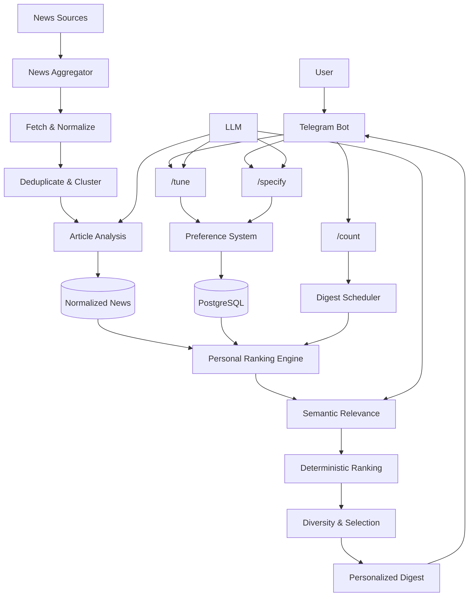
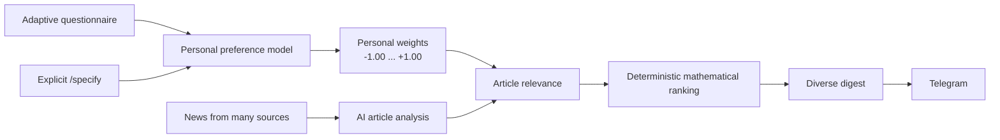
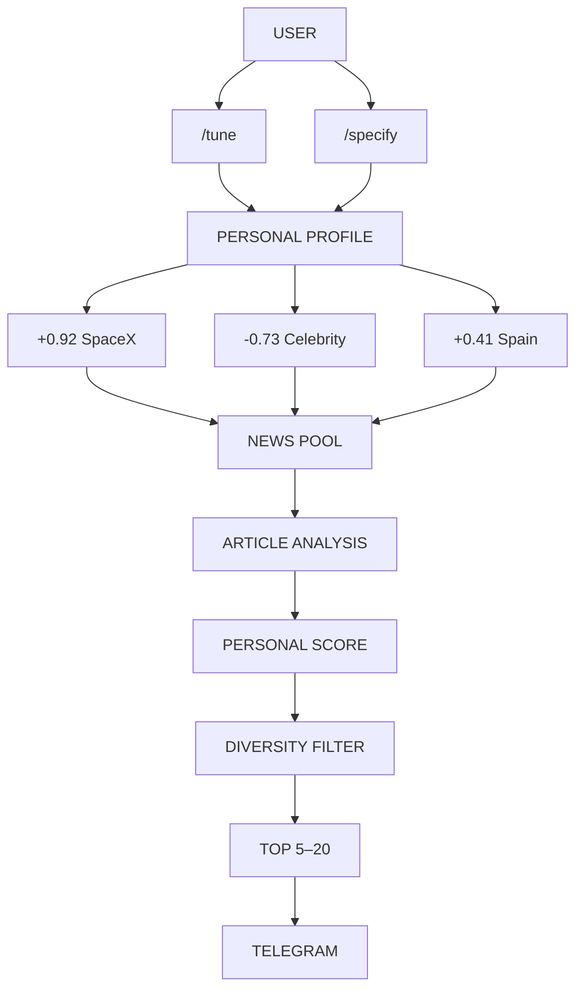

# Personal News Agent 📰

> **Your news. Your interests. Your morning briefing.**

A personalized AI news agent that learns what matters to you and delivers a concise, ranked news digest through Telegram.

---

## Why another news app?

Every day, thousands of news stories compete for our attention.

But the most important question is not:

> **What is the biggest news today?**

It is:

> **What news is worth reading for this particular person?**

Different people have radically different information needs. One person may care deeply about SpaceX, another about events in a particular Russian city, Spanish politics, technology, or disasters around the world.

Traditional news apps mostly make users configure topics and subscriptions manually.

**Personal News Agent takes a different approach: it builds a model of the user's interests and continuously adapts it.**

---

## The core idea

Instead of asking users to configure dozens of topics, the agent gradually learns their preferences through:

- 🧠 **Adaptive questionnaires**
- ✍️ **Explicit user instructions**
- 🤖 **LLM-based semantic analysis**
- 📊 **A transparent mathematical ranking model**
- 🔄 **Continuous preference refinement**

The result is not simply a list of subscribed topics.

It is a **personal information model**.

> You don't configure your news feed.  
> **Your news feed learns how to configure itself for you.**

---

# How it works

## 1. The agent gets to know you

The `/tune` command starts a short adaptive interview.

The user receives exactly **10 questions**, each with four possible answers.

For example:

> **Which area of space exploration interests you most?**
>
> 1. Galaxies
> 2. Extraterrestrial civilizations
> 3. SpaceX news
> 4. Russian space programs

The questions are **not a fixed questionnaire**.

When `/tune` is used again, the system considers:

- previous questions;
- previous answers;
- existing preference parameters;
- already discovered interests.

This allows the questionnaire to progressively explore new or more specific dimensions of the user's interests.

### Good question

> **What would you most like to hear about in your morning briefing?**
>
> 1. Positive news
> 2. Major disasters around the world
> 3. The Russia–Ukraine conflict
> 4. The Spanish royal family

### Bad question

> **Do you want to know about new housing developments in Malaga?**
>
> 1. Probably yes
> 2. No
> 3. Probably not
> 4. Yes

The goal is not to ask generic yes/no questions.

The goal is to **discover meaningful preference dimensions**.

---

# 2. Build a personal preference model

Each user gets an independent set of preference parameters.

For example:

```text
SpaceX                  +0.82
Kirov city news         +0.91
Spanish news            +0.55
Russia / Ukraine        -0.20
Celebrity news          -0.85
Disasters               +0.40
```

Every preference has a weight between:

```text
-1.00 ─────────── 0 ─────────── +1.00
avoid            neutral          interested
```

Weights use increments of `0.01`.

### Meaning

| Weight | Meaning |
|---:|---|
| `+1.00` | Extremely desirable |
| `+0.50` | Moderately interesting |
| `0.00` | Neutral |
| `-0.50` | Moderately undesirable |
| `-1.00` | Strongly undesirable |

Different users can therefore have completely different information profiles.

---

# 3. The profile continuously evolves

The system does not replace the entire profile after every questionnaire.

Instead, preferences are updated incrementally.

For example:

```text
Before:

SpaceX = +0.40

        ↓ /tune

After:

SpaceX = +0.65
```

Every change can be recorded in preference history:

- what changed;
- when it changed;
- why it changed;
- which questionnaire or explicit instruction caused the change.

This makes the preference model auditable.

---

# 4. Tell the agent what you want directly

Users do not have to wait for another questionnaire.

They can explicitly change their interests:

```text
/specify News about the city of Kirov
```

or:

```text
/specify I am especially interested in new energy technologies
```

The LLM interprets the request and proposes changes to the user's preference model.

Explicit user instructions have higher semantic authority than weak preferences inferred from questionnaire answers.

---

# News collection

The system collects news from multiple sources and regions.

The initial scope includes:

- 🌍 World
- 🇷🇺 Russia
- 🇪🇸 Spain

The architecture is designed to support additional countries, languages and sources.

The important architectural principle is a strict separation between:

### News Aggregation

and

### Personal Ranking

The News Aggregator creates a **general pool of high-quality news**.

It does not know which user will eventually read an article.

---

# News Aggregator

The aggregation pipeline:

```text
News Sources
     ↓
Fetch
     ↓
Normalize
     ↓
Validate
     ↓
Deduplicate
     ↓
Event Clustering
     ↓
Article Analysis
     ↓
Normalized News Pool
```

The aggregator can:

- fetch articles from different sources;
- normalize different formats;
- remove exact duplicates;
- detect near-duplicates;
- cluster articles covering the same event;
- identify topics;
- identify people and organizations;
- identify locations;
- estimate general article importance;
- estimate source quality;
- track freshness.

### Importantly

The News Aggregator **does not**:

- load user preferences;
- decide whether an article is interesting to a particular user;
- rank articles for a user;
- modify user preferences.

This separation keeps news collection independent from personalization.

---

# Personal Ranking

After articles have been collected and analyzed, they are evaluated against the user's personal preference model.

Suppose the user has:

```text
SpaceX       +0.80
Russia       +0.30
Celebrity    -0.90
```

And the article is:

> **SpaceX successfully launches Starship**

The semantic analysis might produce:

```text
SpaceX       relevance = +0.95
Russia       relevance =  0.00
Celebrity    relevance =  0.00
```

The application then calculates each contribution:

```text
+0.80 × +0.95 = +0.76
+0.30 ×  0.00 =  0.00
-0.90 ×  0.00 =  0.00
```

Result:

```text
Personal relevance score = +0.76
```

---

# Interest is not importance

This distinction is fundamental.

An article can be:

- extremely important globally but irrelevant to the user;
- relatively unimportant globally but highly interesting to the user;
- both important and interesting;
- neither important nor interesting.

The system therefore keeps **general article importance** separate from **personal relevance**.

Instead of asking:

> "What are today's biggest stories?"

the ranking engine asks:

> **"Which of today's stories are worth reading for this particular user?"**

---

# Ranking model

The final ranking combines several signals:

```text
Personal relevance
        +
Article importance
        +
Freshness
        +
Source quality
        +
Novelty / duplicate penalty
        ↓
Personalized ranking
```

The exact coefficients are configurable.

The most important distinction is that **personal relevance is explicitly modeled rather than hidden inside an opaque recommendation algorithm**.

---

# LLM + deterministic mathematics

The LLM is responsible for tasks where semantic understanding is valuable:

- generating questionnaire questions;
- interpreting questionnaire answers;
- interpreting `/specify`;
- discovering or refining preference parameters;
- analyzing article semantics;
- evaluating article relevance to preference parameters.

The LLM does **not** directly determine the final ranking.

Instead:

```text
LLM
 ↓
Structured semantic scores
 ↓
Validation
 ↓
Deterministic mathematical ranking
 ↓
Final result
```

This makes the final ranking:

- predictable;
- testable;
- reproducible;
- explainable.

---

# Explainable recommendations

The system can retain the information necessary to explain why an article appeared in a digest.

For example:

```text
Why is this article in my digest?

SpaceX
weight:       +0.82
relevance:    +0.95
contribution: +0.78

Technology
weight:       +0.40
relevance:    +0.35
contribution: +0.14

Freshness:    +0.92
Importance:   +0.71

Final score:  +0.83
```

This makes it possible to implement features such as:

> **Why did you show me this article?**

and eventually:

> **Why didn't you show me this article?**

---

# Telegram delivery

The user does not need a separate news application.

The agent can deliver a scheduled digest directly through Telegram:

```text
📰 Your News

1. 🚀 SpaceX successfully launches Starship
   Reuters · 18 min ago

2. 🇪🇸 Malaga introduces new rules ...
   Diario Sur · 42 min ago

3. 🇷🇺 New development announced in Kirov ...
   Local source · 1 hour ago

4. ⚡ New breakthrough in energy technology ...
   TechCrunch · 2 hours ago

5. 🌍 ...
```

The number of articles can be configured:

```text
/count 5
```

or:

```text
/count 15
```

The allowed range is **5–20 articles**.

If only three genuinely relevant stories are available, the system should prefer sending three rather than filling the digest with irrelevant content.

---

# Architecture



---

# The key differentiator

This is not simply:

> **RSS + AI summary**

and it is not simply:

> **AI-powered news search**

The core idea is the combination of:



---

# Why this approach is interesting

Over time, the user does not simply accumulate subscriptions.

The system builds a **machine-readable model of the user's information interests**.



---

# Vision

The user should not have to think:

> "Which topics should I subscribe to?"

Instead, they should be able to think:

> **"What do I need to know today?"**

And the agent should answer:

> **"Out of millions of publications, these are the stories that are actually worth your attention."**

That is the idea behind **Personal News Agent** — a personal AI news concierge that continuously learns what matters to you.

---

# Possible positioning

## Personal News Agent

**Your news. Your interests. Your morning briefing.**

## AI News Concierge

**Don't search for the news. Let your news find you.**

## News that matters to you

**One AI. Thousands of sources. A news feed built for you.**

---

## Project status

> 🚧 **Early-stage project**

The architecture and product concept are being developed incrementally, starting with the core news aggregation, preference modeling, personal ranking, and Telegram delivery capabilities.

