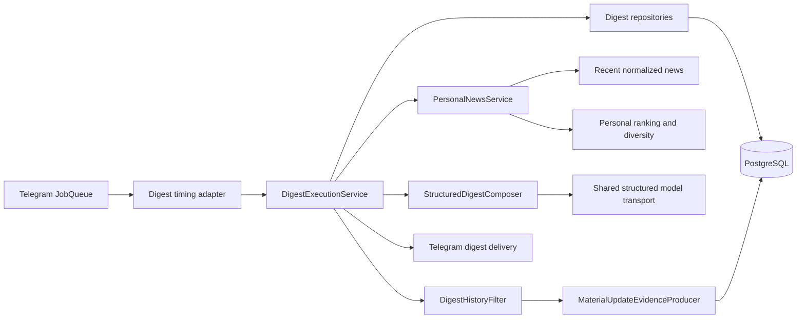
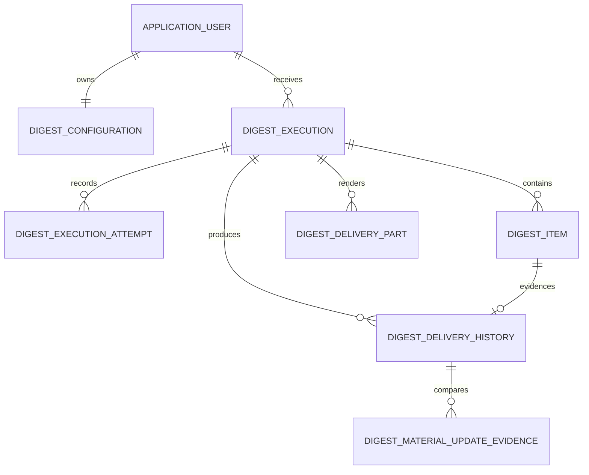
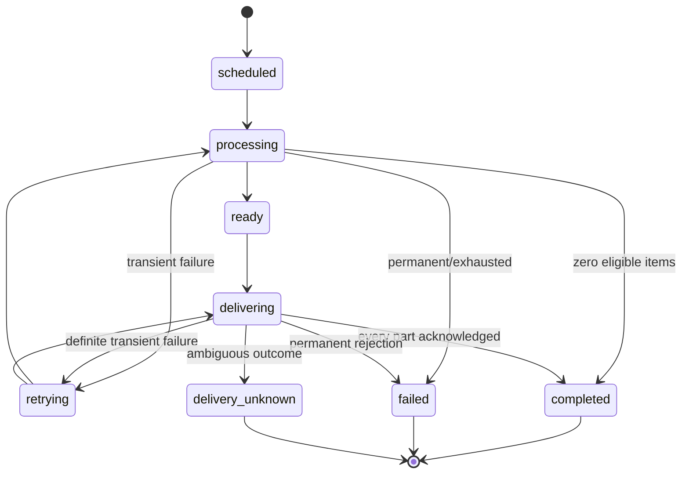
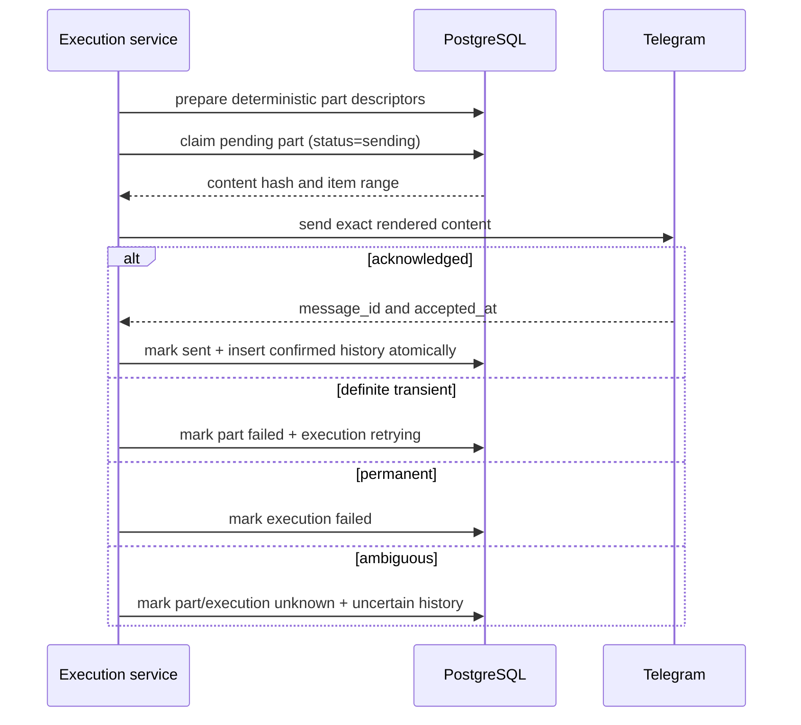

# Architecture: Scheduled News Digests

## Purpose

The digest capability adds durable, timezone-aware scheduled delivery without
moving ranking, news analysis, localization, or Telegram concerns into the
scheduler. It runs inside the existing modular monolith and uses PostgreSQL as
the coordination and recovery boundary.

## Component boundaries

- `digest`: schedule identity, execution lifecycle, composition, delivery state,
  history, material-update evidence, retries, and retention.
- `ranking`: generic candidate preparation, personal evaluation, scoring, and
  diversity. `select_for_user` accepts an optional candidate filter before
  evaluation.
- `news`: normalized articles, accepted analyses, event groups, and duplicate
  evidence.
- `preferences`: application user, language, profile, and semantic preferences.
- `telegram`: `/count`, deterministic digest rendering, and provider error
  classification only.
- `infrastructure/users.py`: sole atomic user/profile/digest provisioner.

## Durable data model

Revision `005_scheduler_digest` creates:

1. `digest_configurations`
2. `digest_executions`
3. `digest_execution_attempts`
4. `digest_items`
5. `digest_delivery_parts`
6. `digest_delivery_history`
7. `digest_material_update_evidence`

The migration backfills every existing user with disabled delivery, count `10`,
local time `09:00`, timezone `UTC`, and `next_due_at = NULL`.

## Occurrence and execution lifecycle

A due claim locks configurations with `FOR UPDATE SKIP LOCKED`, inserts one
execution under unique `(user_id, occurrence_key)`, and advances `next_due_at` in
the same transaction. The occurrence key captures local date, local time, and
IANA timezone. DST folds use the earlier instant; gaps advance to the first
valid local minute.

The scanner drains multiple indexed batches until no work remains, the
per-tick claim maximum is reached, or the monotonic claim-time budget expires.
External model, ranking, and Telegram calls occur after the short claim
transaction.

## Selection and content trust boundary

1. Load recent normalized candidates and ensure complete generic analysis.
2. Apply per-user delivery history before personal evaluation.
3. Reuse personal evaluation, deterministic scoring, and diversity selection.
4. Submit at most 20 bounded grounding records in one structured model request.
5. Validate schema version, exact indexes, counts, title/summary lengths, and
   absence of extra properties.
6. Merge only localized title/summary with deterministic IDs, source, time, URL,
   score, and ranking metadata.
7. Persist the complete immutable item set before rendering.

Model output never supplies identity, ordering, source metadata, destination URL,
score, execution state, or delivery state.

## Delivery and retry sequence

Telegram has no client idempotency key. The design therefore guarantees
at-most-once automatic delivery:

- acknowledged parts are never claimed again;
- definite pre-ack failures may retry only the pending/failed part;
- stale `sending` parts become unknown rather than being blindly reclaimed;
- ambiguous parts are terminal and never automatically resent;
- retries reuse the same execution and ranking request identity.

## Delivery-history policy

The same normalized article is always excluded after confirmed or uncertain
delivery. A later article in the same event may be eligible when:

- accepted complete analysis novelty meets the configured threshold; or
- canonical texts meet minimum lengths, deterministic similarity is at or below
  the configured maximum, and no `duplicate`/`review` pair evidence vetoes it.

The pair/policy result is inserted or loaded atomically and stores text hashes,
threshold snapshots, basis, similarity/novelty, and outcome—not article text.

## Concurrency, retention, and observability

- Unique occurrence and part constraints plus row locks protect overlapping
  ticks and future multiple processes.
- User executions run under bounded asynchronous concurrency with independent
  exception boundaries.
- Retry claims receive a short database lease so overlapping scans do not
  immediately claim the same execution.
- Retention removes expired confirmed terminal history and terminal detail only.
  Active retry and unknown/reconciliation evidence is preserved.
- Digest logs use execution IDs, hashed users/occurrences, bounded counts,
  phases, durations, versions, and canonical reason codes.
- Prompts, model responses, article text, rendered messages, Telegram IDs,
  credentials, tokens, and provider bodies are excluded.
