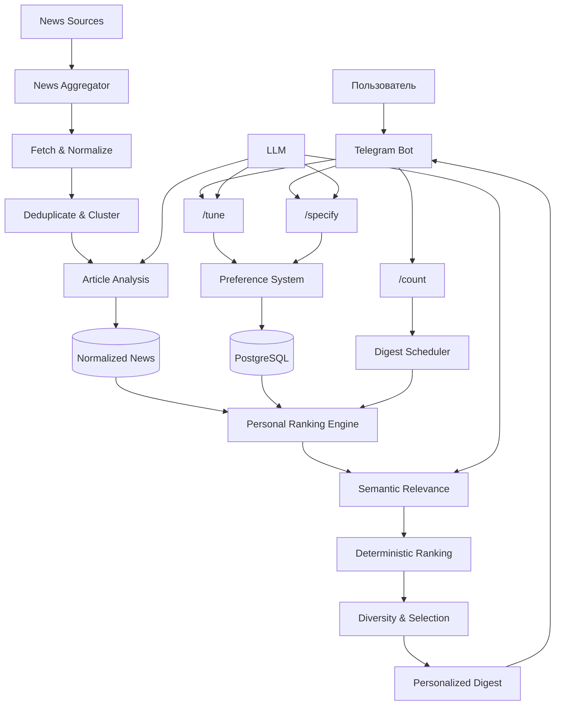
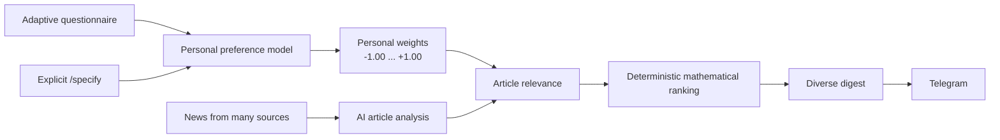
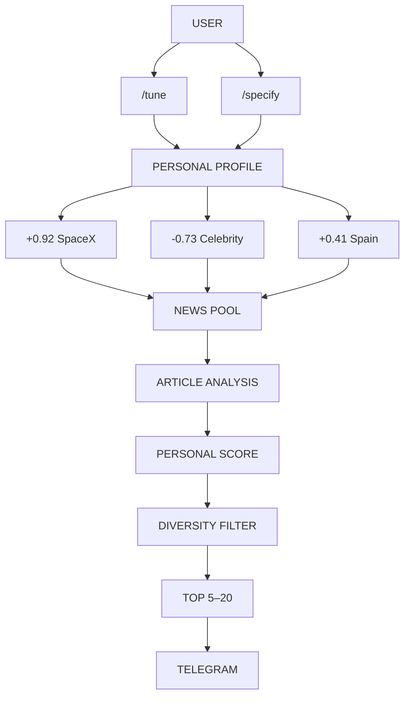

# Personal News Agent — Новости, которые действительно важны вам

## Что, если новости не нужно искать?

Каждый день мы читаем десятки заголовков — и почти все они проходят мимо.

Один человек хочет знать о SpaceX и космосе, другой — о ситуации в России и Украине. Кому-то важны новости Малаги, кому-то — события в городе Кирове. Кто-то хочет видеть только позитивные новости, а кто-то хочет первым узнавать о катастрофах и чрезвычайных ситуациях.

**Почему один и тот же новостной поток должен быть одинаковым для всех?**

Мы создаём персонального AI News Agent, который не просто собирает новости, а **учится понимать, какие новости важны именно вам**.

---

## Не ещё один новостной агрегатор

Обычные news apps предлагают:

- подписаться на темы;
- выбрать категории;
- поставить лайк или дизлайк;
- читать популярные новости;
- настроить RSS-ленты.

Наш подход другой.

Вместо того чтобы заставлять пользователя самому объяснять системе десятки своих интересов, бот **сам постепенно строит персональную модель интересов**.

> Вы не настраиваете новостную ленту.  
> **Лента настраивается под вас.**

---

## Как это работает

### 1. Бот знакомится с вами

Команда `/tune` запускает короткое адаптивное интервью.

Всего **10 простых вопросов**, каждый с четырьмя вариантами ответа.

Например:

> **Какая область изучения космоса вас интересует?**
>
> 1. Галактики  
> 2. Внеземные цивилизации  
> 3. Новости SpaceX  
> 4. Новости России о космосе

Вопросы не являются фиксированной анкетой. Следующий раунд `/tune` учитывает предыдущие вопросы, ответы и уже обнаруженные интересы.

---

## 2. Система создаёт вашу персональную модель интересов

За каждым пользователем закрепляется собственный набор параметров:

```text
SpaceX                 +0.82
Новости города Кирова  +0.91
Новости Испании         +0.55
Россия / Украина        -0.20
Celebrity news          -0.85
Катастрофы              +0.40
```

Значение находится в диапазоне:

```text
-1.00 ───────── 0 ───────── +1.00
избегать       нейтрально       интересно
```

У разных пользователей могут быть совершенно разные параметры.

---

## 3. Профиль постоянно развивается

Система не заменяет ваш профиль после каждого нового опроса. Она постепенно его корректирует.

```text
Было:  SpaceX = +0.40
              ↓ /tune
Стало: SpaceX = +0.65
```

Каждое изменение сохраняется в истории: можно понять, почему появился параметр, почему изменился его вес и какой ответ это вызвал.

---

## 4. Вы можете сказать системе прямо

Не обязательно ждать следующего `/tune`.

```text
/specify Новости города Кирова
```

или:

```text
/specify Мне особенно интересны новые технологии в энергетике
```

AI интерпретирует запрос и изменяет модель интересов.

Явное указание пользователя имеет более высокий приоритет, чем слабый вывод из анкеты.

---

# А что происходит с новостями?

Система собирает новости из множества источников: мировых, российских, испанских и впоследствии любых других регионов.

Но здесь происходит важное разделение.

## News Aggregator

Сначала система формирует **общий качественный пул новостей**:

1. получает новости из разных источников;
2. нормализует их;
3. удаляет технические дубликаты;
4. объединяет публикации об одном событии;
5. определяет темы, людей, организации и географию;
6. оценивает общую важность;
7. определяет качество источника и свежесть.

На этом этапе система **ещё не знает, кому именно эта новость интересна**.

---

# Затем начинается персонализация

Каждая новость сравнивается с вашей персональной моделью.

Например:

```text
User preferences

SpaceX      +0.80
Russia      +0.30
Celebrity   -0.90
```

Для статьи:

> SpaceX successfully launches Starship

AI определяет:

```text
SpaceX      relevance = +0.95
Russia      relevance =  0.00
Celebrity   relevance =  0.00
```

Приложение вычисляет вклад каждого параметра:

```text
+0.80 × +0.95 = +0.76
+0.30 ×  0.00 =  0.00
-0.90 ×  0.00 =  0.00
```

Персональный score:

```text
+0.76
```

---

# Почему это важно?

**Интерес и важность — разные вещи.**

Новость может быть:

- очень важной для мира, но неинтересной вам;
- не очень важной глобально, но чрезвычайно интересной лично вам;
- одновременно важной и интересной;
- неважной и неинтересной.

Поэтому система не просто показывает:

> «Вот самые популярные новости сегодня».

Она пытается ответить:

> **«Какие из сегодняшних новостей стоит прочитать именно вам?»**

---

# Персональный ranking

Итоговый рейтинг учитывает:

```text
Personal relevance
        +
Article importance
        +
Freshness
        +
Source quality
        +
Novelty / duplicate penalty
        ↓
Personalized ranking
```

Персональная релевантность — главный сигнал.

Математическая часть ranking выполняется приложением, а не LLM. Это делает систему предсказуемой, тестируемой, объяснимой и воспроизводимой.

---

# Можно понять, почему новость попала в ваш дайджест

Например:

```text
SpaceX
weight:       +0.82
relevance:    +0.95
contribution: +0.78

Technology
weight:       +0.40
relevance:    +0.35
contribution: +0.14

Freshness:    +0.92
Importance:   +0.71

Final score:  +0.83
```

В будущем это позволяет реализовать:

> **«Почему вы показали мне эту новость?»**

---

# И всё это приходит в Telegram

Пользователь не должен открывать отдельное приложение.

Например:

```text
📰 Ваши новости

1. 🚀 SpaceX успешно запустила Starship
   Reuters · 18 мин назад

2. 🇪🇸 В Малаге изменятся правила ...
   Diario Sur · 42 мин назад

3. 🇷🇺 В Кирове объявили о ...
   Кировская правда · 1 ч назад

4. ⚡ Новый прорыв в ...
   TechCrunch · 2 ч назад

5. 🌍 ...
```

Количество задаётся пользователем:

```text
/count 5
```

или:

```text
/count 15
```

Допустимый диапазон — **5–20 новостей**.

Если действительно интересных новостей только три, система лучше отправит три, чем заполнит дайджест случайным контентом.

---

# Архитектура



---

# Ключевое отличие

Это не просто:

> **RSS + AI summary**

и не просто:

> **AI news search**

Главная идея — соединить несколько уровней:



---

# Почему это может быть интереснее обычного news app

У пользователя постепенно появляется не просто список подписок, а **машиночитаемая модель его информационных интересов**.



---

# Vision

В конечном итоге пользователь не должен думать:

> «Какие темы мне подписать?»

Он должен думать:

> **«Что мне важно знать сегодня?»**

А система должна сама решить:

> **«Из миллионов публикаций вот эти несколько действительно стоит показать этому человеку».**

Это и есть концепция **Personal News Agent** — персонального AI-консьержа новостей, который со временем всё лучше понимает своего пользователя.
